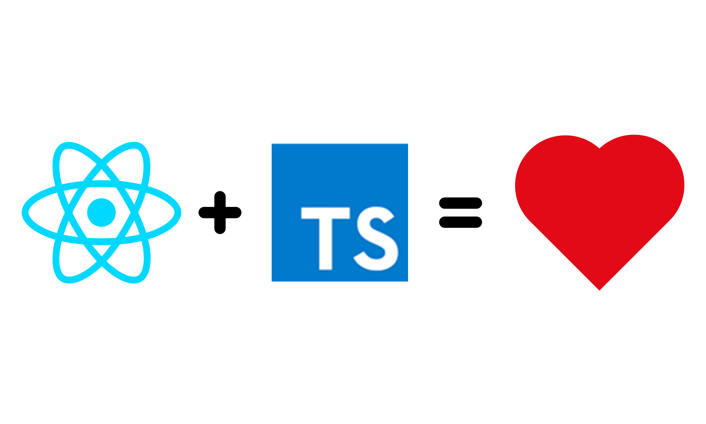

<div align="center">
  
</div>

# React Typescript Library Template

A template to create a react component / library with Typescript.

- React
- Typescript
- Rollup
- Css Modules
- Jest with code coverage report
- `Typedoc` for API documentation
- `commitlint` for conventional-commits
- `Prettier` and `ESLint` integration with git hooks
- Optional `example app` generation for testing
- `Github Pages` integration
- Release-Please workflow

## Install

Clone the repository:

```
git clone --depth 1 git@github.com:alioguzhan/react-typescript-library.git
```

Rename the cloned folder to your library/component name:

```
mv react-typescript-library my-react-lib
```

Install the deps:

```bash
cd my-react-lib
yarn install
```

Once the installation is completed, A prompt will welcome you. Answer those questions and the installer will bootstrap the environment for you.

> You can check if there are any outdated package with [npm-check-updates](https://www.npmjs.com/package/npm-check-updates) tool.

## Development

Write your library code to `src/index.tsx` file and run:

```
yarn start
```

This will watch your changes and reloads the server.

### Commit Messages

This setup expects you to follow conventional-commits format. There is a husky command runs before every commit for validation.

To learn more about conventional commits see [its website](https://www.conventionalcommits.org/en/v1.0.0/).

You can remove that section from `package.json` also remove the related package(s):

```
yarn remove -D @commitlint/cli
```

## Build

Run:

```
yarn build
```

This will create your compiled files under `./dist` folder. And generates a documentation with `TypeDoc` under `./docs` folder.

## Test

Jest is configured and ready to use. Just run:

```
yarn test
```

## Docs

This template uses [TypeDoc](https://typedoc.org/) by default.

Run `yarn make:docs` and a folder named `docs` will be created in your root directory. Just open `index.html` in your browser to see if your like it or not.

## CREDITS

- Logo Design by [@fyunusyildiz](https://github.com/fyunusyildiz)
